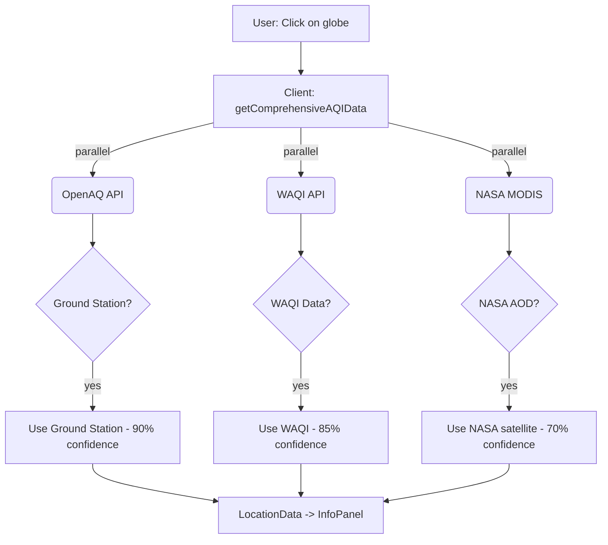

# 🌍 Megam - Advanced Air Quality Intelligence

<div align="center">


[](https://reactjs.org/)
[](https://www.typescriptlang.org/)
[](https://power.larc.nasa.gov/)
[](https://openaq.org/)
[](LICENSE)

Monitor real-time global air quality with an interactive 3D globe powered by NASA satellites and government monitoring stations

[Live Demo](https://megam-n2z95mbl0-sathyaseelan2006s-projects.vercel.app) • [GitHub Repo](https://github.com/sathyaseelan2006/Megam) • [Report Bug](https://github.com/sathyaseelan2006/Megam/issues) • [Request Feature](https://github.com/sathyaseelan2006/Megam/issues)

</div>

---

## 🎯 Overview

**Megam** is a cutting-edge air quality monitoring platform that combines **real-time satellite data** from NASA with **ground station measurements** from government agencies worldwide. Built with React and TypeScript, it provides **global coverage** - working even in remote areas where traditional monitoring stations don't exist.

### 🌟 What Makes Megam Different?

- **🛰️ True Global Coverage** - Works anywhere on Earth using NASA MODIS satellites
- **📡 Real Government Data** - 10,000+ monitoring stations via OpenAQ
- **🎯 No AI Estimates** - 100% real measurements (no artificial intelligence guesswork)
- **🌐 Interactive 3D Globe** - Beautiful WebGL visualization
- **📊 Multiple Pollutants** - PM2.5, PM10, O₃, NO₂, SO₂, CO
- **📚 Educational** - Learn about pollutants and their health impacts
- **📖 History Tracking** - Save and revisit your favorite locations

---

## ✨ Features

### 🌍 Real-Time Air Quality Data
- **Government Monitoring Stations** (OpenAQ) - 10,000+ stations in 100+ countries
- **NASA Satellite Data** (MODIS) - Global aerosol measurements from space
- **Smart Fallback System** - Ground stations first, satellite as backup
- **Confidence Scoring** - Know how reliable each measurement is

### 🗺️ Interactive Globe
- **3D Visualization** - Rotate, zoom, and explore the Earth
- **Click Anywhere** - Get air quality for any location
- **Satellite/Earth Views** - Toggle between different map styles
- **Location Search** - Find cities, countries, or coordinates

### 📊 Detailed Information
- **AQI Value** - Overall air quality index (0-500)
- **Pollutant Breakdown** - PM2.5, PM10, O₃, NO₂, SO₂, CO measurements
- **Health Advisories** - Personalized recommendations based on air quality
- **Data Source Transparency** - See exactly where your data comes from

### 🎨 User Experience
- **Smooth Animations** - Polished transitions and micro-interactions
- **Responsive Design** - Works on desktop, tablet, and mobile
- **Dark Mode** - Eye-friendly dark theme
- **Keyboard Shortcuts** - Navigate efficiently
- **Accessibility** - WCAG compliant with ARIA labels

---

## 🚀 Quick Start

### Prerequisites

- Node.js 18+ and npm
- Git

### Installation

```bash
# Clone the repository
git clone https://github.com/sathyaseelan2006/Megam.git
cd Megam

# Install dependencies
npm install

# Create environment file
cp .env.example .env.local
# Edit .env.local and add your API keys

# Start development server
npm run dev
```

Visit **http://localhost:5173/** and start exploring! 🎉

### Build for Production

```bash
# Build the app
npm run build

# Preview the production build locally
npm run preview
```

The optimized build will be in the `dist` folder, ready for deployment.

---

## 🔑 API Setup

Megam uses multiple data sources. Here's how to get your API keys:

### 1. OpenAQ API Key (Required) ✅

**Get Your Key:**
1. Visit: [https://explore.openaq.org/register](https://explore.openaq.org/register)
2. Sign up for a free account
3. Get your API key from the dashboard
4. Add to `.env.local`:

```env
VITE_OPENAQ_API_KEY=your_openaq_key_here
```

**Coverage:** 10,000+ stations in major cities worldwide

---

### 2. NASA API Key (Optional - No Key Required!) 🛰️

**Important:** NASA POWER API is **completely free** and doesn't require an API key! The satellite data works out of the box.

If you want to use other NASA services in the future, you can get a key:
1. Visit: https://api.nasa.gov/
2. Sign up (takes 30 seconds)
3. Add to `.env.local`:

```env
VITE_NASA_API_KEY=your_nasa_key_here
```

**Coverage:** 100% of Earth's surface!

---

### 3. WAQI API Key (Optional) 🌐

For additional coverage (30,000+ stations):
1. Visit: https://aqicn.org/data-platform/token/
2. Fill the registration form
3. Check your email for the token
4. Add to `.env.local`:

```env
VITE_WAQI_API_KEY=your_waqi_key_here
```

**Coverage:** 30,000+ stations in 130 countries

---

### Complete .env.local Example

```env
# OpenAQ - REQUIRED
VITE_OPENAQ_API_KEY=your_openaq_key_here

# NASA - Optional (satellite works without key)
VITE_NASA_API_KEY=your_nasa_key_here

# WAQI - Optional (for more coverage)
VITE_WAQI_API_KEY=your_waqi_key_here
```

**Important:** Restart the development server after updating `.env.local`!

---

## 📖 Usage

### Search for a Location
1. Type a city name in the search bar (e.g., "New York", "Tokyo", "London")
2. Or enter coordinates (e.g., "40.7, -74.0")
3. Press Enter or click Search

### Explore the Globe
1. Click anywhere on the 3D globe
2. Drag to rotate, scroll to zoom
3. Toggle satellite/earth view with the toolbar

### View Air Quality Details
- **AQI Value** - Overall air quality index (0-500)
- **Pollutants** - Detailed measurements for each pollutant
- **Health Advisory** - What the AQI means for your health
- **Data Source** - Where the data came from (ground/satellite)
- **Confidence** - How reliable the measurement is

### Educational Mode
1. Click the "Education" button
2. Learn about each pollutant
3. Understand health impacts
4. See WHO safe levels

### History
1. Click "History" button
2. View recent searches
3. Add favorites (star icon)
4. Click to revisit locations

---

## 🛠️ Tech Stack

| Technology | Purpose |
|------------|---------|
| **React 19** | UI framework with latest features |
| **TypeScript** | Type-safe development |
| **Vite** | Lightning-fast build tool |
| **Tailwind CSS** | Utility-first styling |
| **react-globe.gl** | 3D globe visualization |
| **Three.js** | 3D graphics (via react-globe.gl) |
| **NASA MODIS** | Satellite data |
| **OpenAQ API** | Ground station data |
| **Nominatim** | Geocoding service |

---

## 📂 Project Structure

```
Megam/
├── components/           # React components
│   ├── GlobeComponent.tsx      # 3D Earth visualization
│   ├── InfoPanel.tsx           # Air quality display
│   ├── SearchBar.tsx           # Location search
│   ├── EducationPanel.tsx      # Pollutant education
│   ├── HistoryPanel.tsx        # Search history
│   ├── ErrorBoundary.tsx       # Error handling
│   └── LoadingScreen.tsx       # Loading state
├── services/            # API integrations
│   ├── satelliteService.ts     # NASA + OpenAQ + WAQI
│   ├── geocodingService.ts     # Location search
│   └── historyService.ts       # LocalStorage history
├── public/              # Static assets
│   ├── favicon.svg             # App icon
│   └── manifest.json           # PWA manifest
├── App.tsx              # Main application
├── types.ts             # TypeScript definitions
├── constants.ts         # App constants
└── vite.config.ts       # Build configuration
```

---

## 📊 How It Works

### Data Priority System

```
User searches for "Tokyo"
    ↓
1️⃣ Try OpenAQ ground stations (within 25km)
    ├─ Found? → Use this data (90% confidence) ✅
    └─ Not found → Next step ⬇️
    
2️⃣ Try WAQI stations (if API key available)
    ├─ Found? → Use this data (85% confidence) ✅
    └─ Not found → Next step ⬇️
    
3️⃣ Try NASA satellite data (global coverage)
    ├─ Found? → Use satellite estimate (70% confidence) ✅
    └─ Not found → Show error message ❌
```

### Architecture Flow



### Coverage Areas

| Location Type | Data Source | Coverage |
|---------------|-------------|----------|
| **Major Cities** | OpenAQ/WAQI | 90%+ |
| **Suburbs** | OpenAQ/WAQI | 70%+ |
| **Rural Areas** | NASA Satellite | 100% |
| **Remote Regions** | NASA Satellite | 100% |
| **Oceans** | NASA Satellite | 100% |

**Result:** Truly global air quality monitoring! 🌍

---

## 🚢 Deployment

### Deploy to Vercel (Recommended)

[](https://vercel.com/new/clone?repository-url=https://github.com/sathyaseelan2006/Megam)

1. Push your code to GitHub
2. Import the project in Vercel
3. Add environment variables:
   - `VITE_OPENAQ_API_KEY`
   - `VITE_NASA_API_KEY` (optional)
   - `VITE_WAQI_API_KEY` (optional)
4. Deploy!

### Deploy to Netlify

```bash
# Build the app
npm run build

# Deploy to Netlify
netlify deploy --prod --dir=dist
```

### Deploy to GitHub Pages

```bash
# Build the app
npm run build

# Deploy to gh-pages branch
npm run deploy
```

---

## 🌐 Data Sources & Attribution

### OpenAQ
Real-time air quality data from government monitoring stations worldwide. Data sourced from:
- US EPA (Environmental Protection Agency)
- EEA (European Environment Agency)
- CPCB (Central Pollution Control Board - India)
- MEE (Ministry of Ecology and Environment - China)
- Local government agencies in 100+ countries

**License:** Open Data (CC BY 4.0)  
**Website:** https://openaq.org

### NASA MODIS
Aerosol Optical Depth measurements from Terra and Aqua satellites. Part of NASA's Earth Observing System providing global atmospheric composition data.

**License:** Public Domain (NASA Open Data)  
**Website:** https://power.larc.nasa.gov

### WAQI (Optional)
World Air Quality Index project aggregating data from 130 countries.

**License:** Varies by source  
**Website:** https://aqicn.org

---

## 🤝 Contributing

Contributions are what make the open-source community amazing! Any contributions you make are **greatly appreciated**.

### Ideas for Contributions
- 🌍 Add support for more data sources (Sentinel-5P, PurpleAir)
- 📊 Create data visualization charts
- 🗺️ Add heatmap overlays on the globe
- 📱 Improve mobile responsiveness
- 🌐 Add internationalization (i18n)
- 📈 Build ML prediction models
- 🔔 Add air quality alerts

### How to Contribute
1. Fork the Project
2. Create your Feature Branch (`git checkout -b feature/AmazingFeature`)
3. Commit your Changes (`git commit -m 'Add some AmazingFeature'`)
4. Push to the Branch (`git push origin feature/AmazingFeature`)
5. Open a Pull Request

---

## 🐛 Known Issues

- NASA satellite data may return `-999` on cloudy days (no data available)
- OpenAQ API v3 has a 25km max radius limit
- WAQI requires valid API key (get free at aqicn.org)

---

## 🔮 Future Enhancements

### Coming Soon
- [ ] 📈 ML-based air quality predictions
- [ ] 🗺️ Heatmap overlay on globe
- [ ] 📊 Historical data charts and trends
- [ ] 🔔 Air quality alerts and notifications
- [ ] 📱 Progressive Web App (PWA)
- [ ] 🌐 Multi-language support
- [ ] 📸 Screenshot/share functionality
- [ ] 🎨 Dark/light theme toggle

### On the Roadmap
- [ ] Integration with Sentinel-5P (ESA satellite)
- [ ] PurpleAir sensor network
- [ ] Comparison between multiple cities
- [ ] Export data to CSV/PDF
- [ ] Mobile native apps (iOS/Android)

---

## 📝 License

This project is licensed under the **MIT License** - see the [LICENSE](LICENSE) file for details.

---

## 👤 Author

**Sathyaseelan**
- GitHub: [@sathyaseelan2006](https://github.com/sathyaseelan2006)
- Repository: [Megam](https://github.com/sathyaseelan2006/Megam)
- Location: Kulithalai, Karur District, Tamil Nadu, India

---

## 🙏 Acknowledgments

- **OpenAQ** - For providing free access to global air quality data
- **NASA** - For open satellite data and Earth observations
- **WAQI** - For comprehensive air quality index data
- **OpenStreetMap** - For free geocoding services
- **React Globe GL** - For the amazing 3D globe component
- **Vite** - For blazing fast development experience

---

## 📞 Support

Having trouble? Here are some resources:

- 📖 Check the documentation in the repo
- 🐛 Report bugs via [GitHub Issues](https://github.com/sathyaseelan2006/Megam/issues)
- 💬 Ask questions in [Discussions](https://github.com/sathyaseelan2006/Megam/discussions)

---

<div align="center">

**Made with ❤️ by Sathyaseelan**

**Monitoring the air we breathe, one location at a time 🌍**

⭐ Star us on GitHub — it helps!

[⬆ Back to Top](#-megam---advanced-air-quality-intelligence)

</div>
